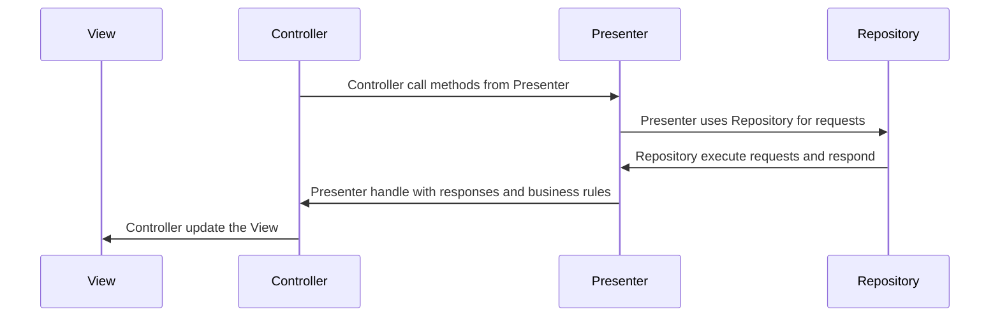

# Shopping Search App
App de busca de produtos integrado a API de busca do Mercado Livre desenvolvido usando Swift.

## Instruções para execução do app
Para rodar o app, basta abrir o arquivo `Shopping Search App.xcodeproj`, aguardar a instalação das dependências através do SPM e executar o mesmo.

## Testes Unitários
Para realizar a execução dos testes unitários, por favor, selecione o *iPhone SE (3rd generation) (17.0)* e rode o simulador em Light Mode.

Como dentro dos testes unitários existem testes de snapshots e os mesmos foram gravados utilizando esse simulador, isso garantirá a consistência e integração do que foi testado.

## Arquitetura

Esse projeto foi desenvolvido utilizando a arquitetura **MVP (Model-View-Presenter)**.

